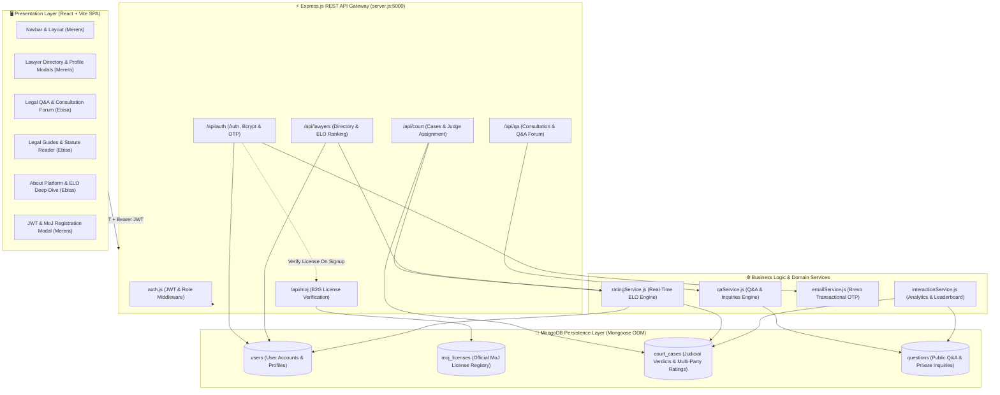
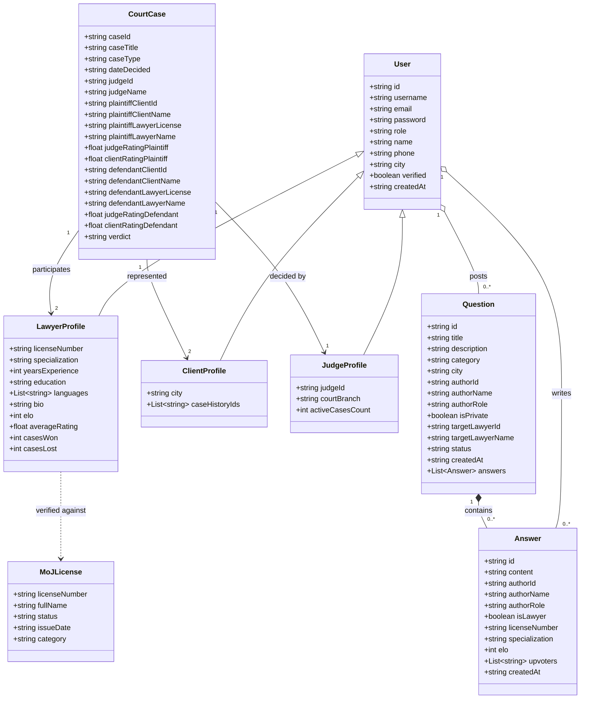

# ⚖️ EthioLaw B2G Legal Rating System (LEX-RATING)

> **Digital Legal Advocacy, Case Management & Verified B2G Rating Platform**

---

## 👥 Project Team & Engineering Task Division

|  #  | Team Member |  Student ID   | Primary Engineering Role |      Assigned Branch       | Primary Modules & Files                                                                                                                                                                                                                                                                                                                                                                                   |
| :-: | :---------- | :-----------: | :----------------------- | :------------------------: | :-------------------------------------------------------------------------------------------------------------------------------------------------------------------------------------------------------------------------------------------------------------------------------------------------------------------------------------------------------------------------------------------------------- |
|  1  | **Lemi**    | `CTC-1272-26` | **Backend Developer 1**  |    `backend/auth-court`    | **Authentication, Court System & ELO Rating Engine**<br>• `server/routes/authRoutes.js`<br>• `server/routes/courtRoutes.js`<br>• `server/routes/lawyerRoutes.js`<br>• `server/services/ratingService.js`<br>• `server/services/emailService.js`<br>• `server/middleware/auth.js`<br>• Models: `User.js`, `CourtCase.js`                                                                                   |
|  2  | **Kumala**  | `CTC-0000-26` | **Backend Developer 2**  |      `backend/qa-moj`      | **MongoDB Core, Legal Q&A, MoJ Gateway & Analytics**<br>• `server/lib/mongoose.js` (MongoDB Setup)<br>• `server/routes/qaRoutes.js`<br>• `server/routes/mojRoutes.js`<br>• `server/services/qaService.js`<br>• `server/services/interactionService.js`<br>• Models: `Question.js`, `MojLicense.js`                                                                                                        |
|  3  | **Merera**  | `CTC-0000-26` | **Frontend Developer 1** | `frontend/directory-views` | **Navigation, Auth & Lawyer Directory System**<br>• `src/components/layout/Navbar.jsx`<br>• `src/components/layout/Footer.jsx`<br>• `src/components/common/` (ModalBackdrop, StarRow, EloBar)<br>• `src/features/auth/AuthModal.jsx`<br>• `src/features/directory/` (LawyerCard, LawyerModal)<br>• `src/pages/Home.jsx`<br>• `src/pages/DirectoryPage.jsx`<br>• `src/utils/` (storage.js, ratingUtils.js) |
|  4  | **Ebisa**   | `CTC-0000-26` | **Frontend Developer 2** |    `frontend/qa-guides`    | **Legal Q&A, Legal Guides & About Platform**<br>• `src/features/qa/QuestionThreadModal.jsx`<br>• `src/features/qa/AskQuestionModal.jsx`<br>• `src/features/guides/` (GuideCard, GuideModal)<br>• `src/pages/QAPage.jsx`<br>• `src/pages/GuidesPage.jsx`<br>• `src/pages/AboutPage.jsx`<br>• `src/data/legalGuides.js`<br>• `src/services/api.js` (Q&A & Inquiries Client)                                 |

**🎓 Academic Supervision:** Developed under the guidance of INSA faculty and repository instructors.

---

## 📌 Executive Summary

The **EthioLaw Legal Rating & Judicial Matchmaking System (LEX-RATING)** is an integrated B2G (Business-to-Government) and B2C web platform designed specifically for the Ethiopian legal ecosystem. Inspired by global legal directories like _Avvo_, the system is customized to reflect Ethiopian judicial procedures, regional jurisdictions, advocate licensing frameworks, and multi-tier court dispute lifecycles.

### Key Value Propositions

- **🛡️ Official Ministry of Justice (MoJ) B2G License Verification**: Real-time verification of practicing licenses against official Ministry registries (`LAW-XXXX`) to prevent unauthorized legal practice.
- **📈 Real-Time Multi-Party ELO Rating Algorithm**: Dynamic computation of lawyer competence ratings based on verified judicial case outcomes, judge ratings, and client feedback ($K=32$).
- **🏛️ Judicial Case Management & RBAC Protection**: Federal court case registration protected with Role-Based Access Control (`requireRole('judge', 'admin')`).
- **🎨 Modern LEX UI Design System**: Tailored dark navy (`#0F172A`) palette, gold balance scale branding, vector SVG icons, advocate photo quote showcases, and clean card elevations (`border: 1px solid #E2E8F0`).
- **💬 Legal Q&A & Private Consultation Forum**: Confidential client-to-lawyer inquiries with one-click publishing to the public community repository upon resolution.
- **📚 Ethiopian Legal Guides Knowledge Base**: Contextual plain-language guides covering Family Law, Labor Proclamations, Criminal Defense, and Commercial Code.
- **🔐 Multi-Factor Authentication & Security**: Passwords hashed with `bcrypt` (10 rounds), signed JWT token authorization, and automated OTP verification dispatch via Brevo Transactional Email.
- **🍃 MongoDB & JSON Fallback Storage Layer**: Mongoose ODM schemas for users, court cases, Q&A consultations, and MoJ license registries, with seamless local JSON fallback.
- **🐳 Docker Multi-Stage Containerization**: Orchestrated deployment via Docker Compose (`frontend`, `backend`, `mongodb`).

---

## 🏛️ System Architecture



---

## 🎨 LEX UI Design System & Component Architecture

| Component                   | Design System Details                                                            | Key Features & Restored Elements                                                                                                                                                                  |
| --------------------------- | -------------------------------------------------------------------------------- | ------------------------------------------------------------------------------------------------------------------------------------------------------------------------------------------------- |
| **Navbar Header**           | Gold Balance Scale Logo + `LEX` title, Dark Navy `#0F172A` buttons               | Links (`Home`, `Lawyers`, `Q&A`, `Resources`, `About Us`, `Contact`), Search icon trigger, User Profile badge, Sign Up button                                                                     |
| **Home Hero**               | Split layout with Courtroom imagery & lowered 3-field Search Card                | Search Keyword, Practice Area dropdown, Ethiopian City dropdown, _"Why LEX?"_ 4-feature grid                                                                                                      |
| **Advocate Quote Showcase** | Full-width high-contrast photo strips (`advocate-quote-1.jpg`, `2.jpg`, `3.jpg`) | Advocate Tigist Alemu Bekele, Advocate Kebede Haile Mariam, Advocate Yetnebersh Nigussie quotes                                                                                                   |
| **Lawyer Card**             | Card shape (`border: 1px solid #E2E8F0`, `border-radius: 14px`)                  | ELO Rating badge, Cases Handled count, Licensed Tenure, Star Rating score, Location, Specialization, _"View Profile"_ button                                                                      |
| **Lawyer Profile Drawer**   | Dark Navy Header Banner + 4 Stat Cards + 3 Detail Tabs                           | `Overview & Practice` (ELO Bar, platform score, bio, office address, consultation fee, client reviews), `Admissions & Background` (education, court benches, MoJ table), `Recognition & Activity` |
| **Directory Page**          | 2-column sidebar layout                                                          | Sidebar Practice Area & City lists, twin search inputs, quick filter chips (`.lex-chip`), live results counter                                                                                    |
| **Q&A Forum**               | Community Q&A & Private Inquiries tabs                                           | Public & Private tabs, search bar, category chips, question cards, verified advocate response cards, `AskQuestionModal`                                                                           |
| **Resources & Guides**      | Plain-language Ethiopian Legal Knowledge Base                                    | Category filters, read time chips, statutory proclamation badges, `GuideModal` reader with citizen checklists & FAQs                                                                              |
| **About Us Page**           | Comprehensive platform guide                                                     | Hero section, Meaning of LEX callout box, 3 Core Tenets (TRUST, REVIEW, CHOOSE), Platform Numbers (`100%`, `2,500+`, `11`), 4 Pillars grid, Testimonial cards                                     |

---

## 🛠️ Complete Engineering Task Division & Architecture

### Backend Engineering

```
                             LEX-RATING BACKEND
                                      │
              ┌───────────────────────┴───────────────────────┐
              ▼                                               ▼
   Backend Dev 1 (Lemi)                         Backend Dev 2 (Kumalay)
  [backend/auth-court]                            [backend/qa-moj]
  ─────────────────────────────────               ─────────────────────────────────
  • User & CourtCase Models                       • MongoDB Setup (server/lib/mongoose.js)
  • JWT Auth & Bcrypt Hashing                     • Question & MoJ License Models
  • Auth Middleware (requireAuth/Role)            • Q&A Service & Endpoints
  • Court Case Registration (Judge Only)          • MoJ Registry Verification
  • ELO Rating Engine & Win-Rate Math             • Community Analytics & Leaderboard
  • Brevo Email Service & OTP Dispatch            • Seed & Data Migration Script
```

#### 1. Backend Dev 1 (Lemi) — `backend/auth-court`

- **Domain**: Authentication, Court System, Lawyer Search & ELO Rating Engine.
- **Files Assigned**:
  - `server/routes/authRoutes.js`
  - `server/routes/courtRoutes.js`
  - `server/routes/lawyerRoutes.js`
  - `server/services/ratingService.js`
  - `server/services/emailService.js`
  - `server/middleware/auth.js`
- **Mongoose Models**:
  - `User.js`: Schema for Litigants, Advocates, Judges, and Admins.
  - `CourtCase.js`: Schema for judicial proceedings, lawyer licenses, judge/client ratings, and verdicts.
- **Key Tasks**:
  - Implement MongoDB CRUD for user registration, login, and profile updates.
  - Password security using `bcrypt` (10 rounds) and JWT signing/verification.
  - OTP generation, verification, and `/resend-otp` flow using Brevo Transactional Email.
  - Role-based access control on `POST /api/court/cases` (restricted to `judge` and `admin`).
  - Dynamic ELO rating recalculation and case win/loss record aggregation in `ratingService.js`.

#### 2. Backend Dev 2 (Kumalay) — `backend/qa-moj`

- **Domain**: MongoDB Database Configuration, Legal Q&A, Inquiries, MoJ Gateway & Analytics.
- **Files Assigned**:
  - `server/lib/mongoose.js`
  - `server/routes/qaRoutes.js`
  - `server/routes/mojRoutes.js`
  - `server/services/qaService.js`
  - `server/services/interactionService.js`
- **Mongoose Models**:
  - `Question.js`: Schema for public questions, private consultations, sub-document answers, and upvoters.
  - `MojLicense.js`: Schema for Ministry of Justice official advocate licensing records.
- **Key Tasks**:
  - Setup MongoDB connection with Mongoose in `server/lib/mongoose.js` and initialize in `server/server.js`.
  - Create data seed/migration script to import data into MongoDB collections.
  - Migrate Q&A and private inquiries CRUD operations to MongoDB.
  - Atomic upvote toggling using MongoDB `$addToSet` / `$pull` operators.
  - Protect Q&A write endpoints with `requireAuth` middleware.
  - MoJ license validation queries in `mojRoutes.js`.
  - Advocate interaction scores and leaderboard rankings in `interactionService.js`.

---

### Frontend Engineering

```
                            LEX-RATING FRONTEND
                                      │
              ┌───────────────────────┴───────────────────────┐
              ▼                                               ▼
   Frontend Dev 1 (Merera)                           Frontend Dev 2 (Ebisa)
  [frontend/directory-views]                      [frontend/qa-guides]
  ─────────────────────────────────               ─────────────────────────────────
  • Layout (Navbar, Footer)                       • Legal Q&A Page & Category Chips
  • Common UI (ModalBackdrop, StarRow, EloBar)    • Question Thread Modal & Replies
  • Auth Modal (Login, MoJ Register, OTP)         • Ask Question / Private Inquiry Modal
  • Advocate Card & Full Profile Modal            • Legal Guides Catalog & Category Filters
  • Home Page (Hero, Search, Leaderboard)         • Legal Guide Reader & Statute Citations
  • Directory Page & Sidebar Filtering            • About Page (Avvo/LEX-RATING Platform)
```

#### 1. Frontend Dev 1 (Merera) — `frontend/directory-views`

- **Domain**: Layout, Common Design System, Advocate Directory & User Authentication.
- **Files Assigned**:
  - `src/components/layout/Navbar.jsx`
  - `src/components/layout/Footer.jsx`
  - `src/components/common/ModalBackdrop.jsx`
  - `src/components/common/StarRow.jsx`
  - `src/components/common/EloBar.jsx`
  - `src/features/auth/AuthModal.jsx`
  - `src/features/directory/LawyerCard.jsx`
  - `src/features/directory/LawyerModal.jsx`
  - `src/pages/Home.jsx`
  - `src/pages/DirectoryPage.jsx`
  - `src/utils/storage.js`
  - `src/utils/ratingUtils.js`

#### 2. Frontend Dev 2 (Ebisa) — `frontend/qa-guides`

- **Domain**: Legal Q&A Community Forum, Private Inquiries, Legal Guides Reader & About Platform.
- **Files Assigned**:
  - `src/features/qa/QuestionThreadModal.jsx`
  - `src/features/qa/AskQuestionModal.jsx`
  - `src/features/guides/GuideCard.jsx`
  - `src/features/guides/GuideModal.jsx`
  - `src/pages/QAPage.jsx`
  - `src/pages/GuidesPage.jsx`
  - `src/pages/AboutPage.jsx`
  - `src/data/legalGuides.js`
  - `src/services/api.js`

---

## 📐 Class & Domain Model Diagram



---

## 🧮 Real-Time ELO Rating Mathematical Engine

The LEX-RATING algorithm bridges the gap between subjective feedback and objective judicial performance. Every registered advocate starts with a neutral baseline of **`1000 ELO`**.

### 1. Case Performance Score ($P$)

For each case, performance is synthesized from the official presiding Judge rating ($R_{\text{judge}} \in [1, 5]$) and the represented Client rating ($R_{\text{client}} \in [1, 5]$):
$$P = \frac{R_{\text{judge}} + R_{\text{client}}}{2}$$

### 2. ELO Update Formula

The platform uses the international competitive standard **$K$-Factor of $32$**, calibrated against a **$3.5$ neutral baseline**:
$$\text{ELO}_{\text{new}} = \text{ELO}_{\text{old}} + \operatorname{round}\Big(32 \times (P - 3.5)\Big)$$

- **Exemplary Case ($P = 5.0$)**: $\Delta \text{ELO} = +32 \times (1.5) = \mathbf{+48\text{ ELO}}$
- **Standard Case ($P = 3.5$)**: $\Delta \text{ELO} = +32 \times (0.0) = \mathbf{0\text{ ELO}}$
- **Subpar Performance ($P = 2.0$)**: $\Delta \text{ELO} = +32 \times (-1.5) = \mathbf{-48\text{ ELO}}$

---

## 📡 REST API Reference Specification

### 🔐 1. Authentication & Identity (`/api/auth`)

| Method | Route                       | Description                                         | Auth / Role |
| ------ | --------------------------- | --------------------------------------------------- | ----------- |
| `POST` | `/api/auth/register`        | Initiates registration, hashes password & sends OTP | Public      |
| `POST` | `/api/auth/register-verify` | Validates OTP and persists user                     | Public      |
| `POST` | `/api/auth/login`           | Validates credentials & returns JWT token           | Public      |
| `POST` | `/api/auth/resend-otp`      | Re-dispatches OTP verification code                 | Public      |
| `GET`  | `/api/auth/me`              | Returns authenticated user's profile                | 🔒 Token    |
| `PUT`  | `/api/auth/profile`         | Updates user profile fields                         | 🔒 Token    |
| `PUT`  | `/api/auth/theme`           | Syncs light/dark theme preference                   | 🔒 Token    |

### 🏛️ 2. Ministry of Justice Gateway (`/api/moj`)

| Method | Route                     | Description                          | Auth / Role |
| ------ | ------------------------- | ------------------------------------ | ----------- |
| `POST` | `/api/moj/verify-license` | Validates practitioner bar license   | Public      |
| `GET`  | `/api/moj/licenses`       | Returns official MoJ license records | Public      |

### ⚖️ 3. Judicial Court System (`/api/court`)

| Method | Route                                     | Description                          | Auth / Role         |
| ------ | ----------------------------------------- | ------------------------------------ | ------------------- |
| `GET`  | `/api/court/cases`                        | Retrieves judicial case records      | Public              |
| `POST` | `/api/court/cases`                        | Registers verdict & party ratings    | 🔒 `judge`, `admin` |
| `GET`  | `/api/court/lawyer-rating/:licenseNumber` | Computes on-the-fly ELO & case stats | Public              |

### 🔍 4. Advocate Directory & Discovery (`/api/lawyers`)

| Method | Route                      | Description                                  | Auth / Role |
| ------ | -------------------------- | -------------------------------------------- | ----------- |
| `GET`  | `/api/lawyers/search`      | Search advocates filtered by spec, city, ELO | Public      |
| `GET`  | `/api/lawyers/leaderboard` | Top interactive legal practitioners          | Public      |

### 💬 5. Legal Q&A & Consultations (`/api/qa`)

| Method | Route                                       | Description                                    | Auth / Role         |
| ------ | ------------------------------------------- | ---------------------------------------------- | ------------------- |
| `GET`  | `/api/qa/questions`                         | Fetches public community questions (paginated) | Public              |
| `GET`  | `/api/qa/questions/:id`                     | Fetches a single question thread               | Public              |
| `GET`  | `/api/qa/inquiries`                         | Fetches private client-lawyer inquiries        | Public (User query) |
| `POST` | `/api/qa/questions`                         | Submits public question or private inquiry     | 🔒 `requireAuth`    |
| `POST` | `/api/qa/questions/:id/publish`             | Author publishes private inquiry to forum      | 🔒 `requireAuth`    |
| `POST` | `/api/qa/questions/:id/answers`             | Posts answer to question thread                | 🔒 `requireAuth`    |
| `POST` | `/api/qa/questions/:id/answers/:aid/upvote` | Toggles upvote on answer                       | 🔒 `requireAuth`    |

---

## 💻 Installation & Getting Started

### 1. Prerequisites

- **Node.js** (v18.x or higher)
- **MongoDB** (Local instance or MongoDB Atlas connection string)
- **npm** (v9.x or higher)
- **Git**

### 2. Clone the Repository

```bash
git clone https://github.com/Ethio-Legal-Platform/Lawyer-Rating-System-.git
cd Lawyer-Rating-System-
```

### 3. Configure Environment Variables

Create a `.env` file in the project root directory:

```env
PORT=5000
MONGODB_URI=mongodb+srv://<username>:<password>@cluster0.vqsc69h.mongodb.net/lexrating?retryWrites=true&w=majority
JWT_SECRET=your_secure_jwt_secret_key_here

# Brevo Transactional Email Service
BREVO_API_KEY=your_brevo_api_key_here
BREVO_SENDER_EMAIL=noreply@lexrating.et
BREVO_SENDER_NAME="LEX-RATING"
```

### 4. Install Dependencies & Launch

```bash
# Install all dependencies
npm install

# Start both Express Backend & React Vite Frontend concurrently
npm start
```

- **Frontend UI**: `http://localhost:5173`
- **Backend API Gateway**: `http://localhost:5000`
- **API Health Check**: `http://localhost:5000/`

---

## 🐳 Docker Deployment & Containerization

The system is fully containerized using multi-stage Docker builds and Docker Compose for production deployment.

### Container Architecture

- **Frontend Container (`frontend`)**: React Vite SPA built and served via Nginx Alpine on Port `80` with SPA fallback and reverse proxying `/api/` traffic to the backend container.
- **Backend Container (`backend`)**: Express.js REST API running Node 20 Alpine on Port `5000`.
- **Database Container (`mongodb`)**: MongoDB database on Port `27017` with persistent volume `mongo_data`.

### Quick Start with Docker Compose

```bash
# 1. Clone the repository
git clone https://github.com/Ethio-Legal-Platform/Lawyer-Rating-System-.git
cd Lawyer-Rating-System-

# 2. Start all services in detached mode
docker compose up -d --build

# 3. Verify running containers
docker compose ps
```

### Accessing Containers

- **Web Application UI**: `http://localhost`
- **Backend API Gateway**: `http://localhost:5000`
- **MongoDB Connection**: `mongodb://localhost:27017/lexrating`

### Stop & Cleanup

```bash
# Stop containers without removing volumes
docker compose down

# Stop containers and remove volumes
docker compose down -v
```

---

## 📜 Academic Disclaimer

This software was engineered as an academic demonstration for the **INSA 2026 Legal Technologies Program**. Legal guides, simulated court records, and lawyer profiles are for testing, educational, and matching purposes.
